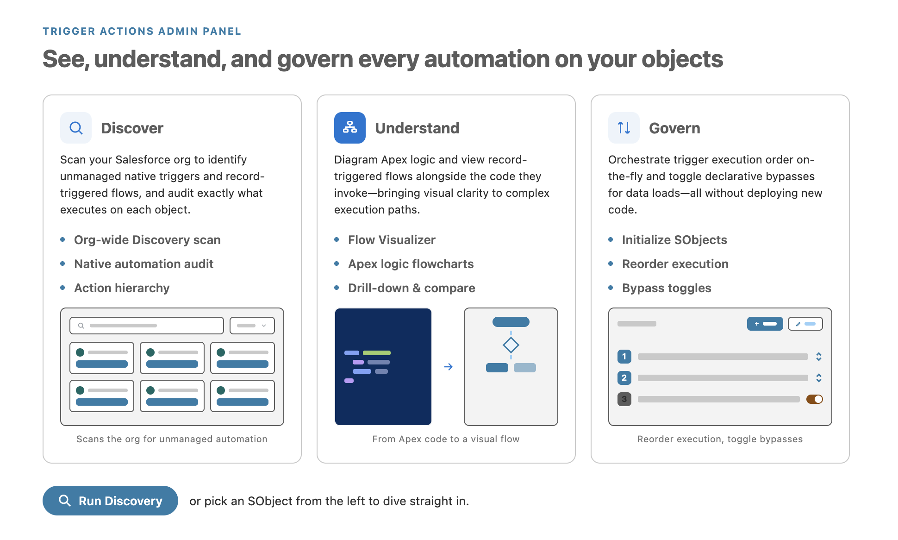
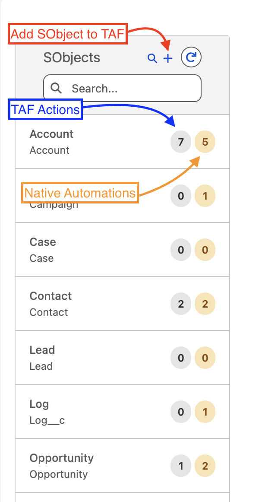
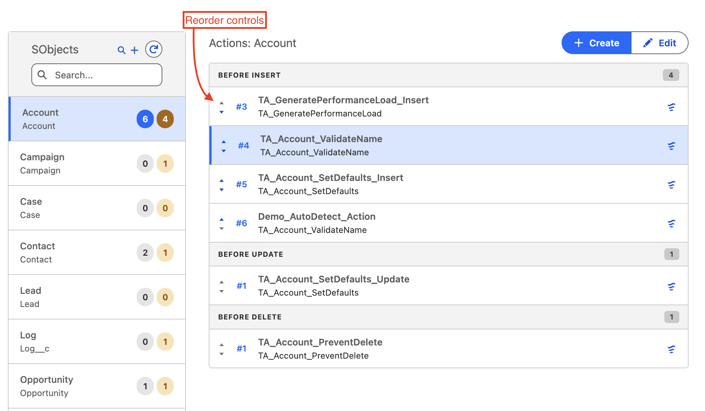
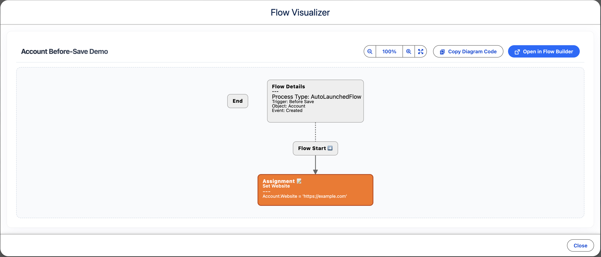
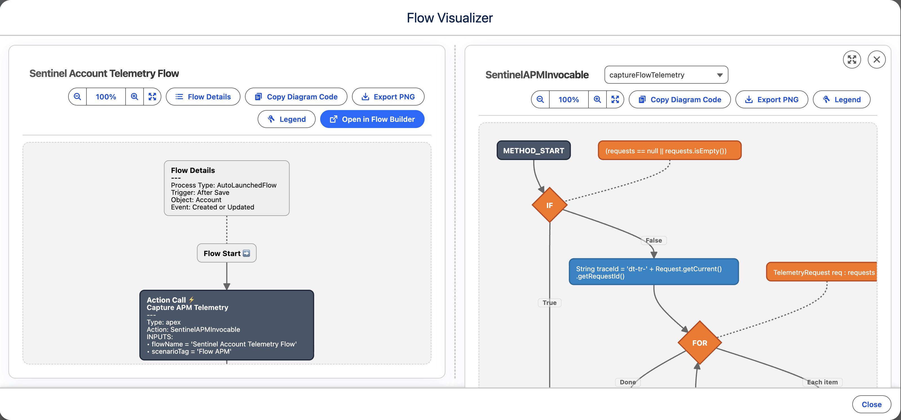
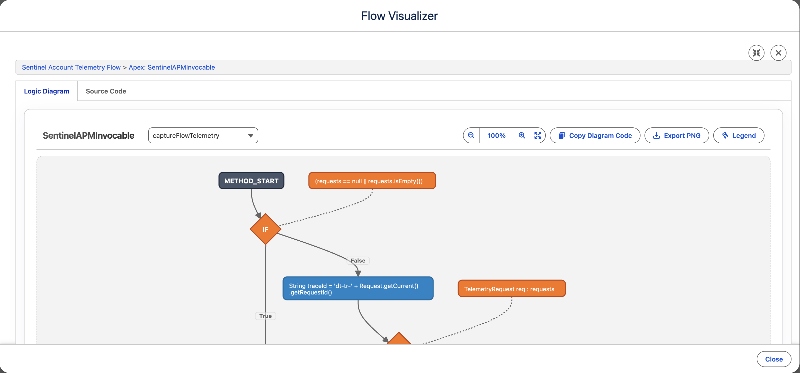
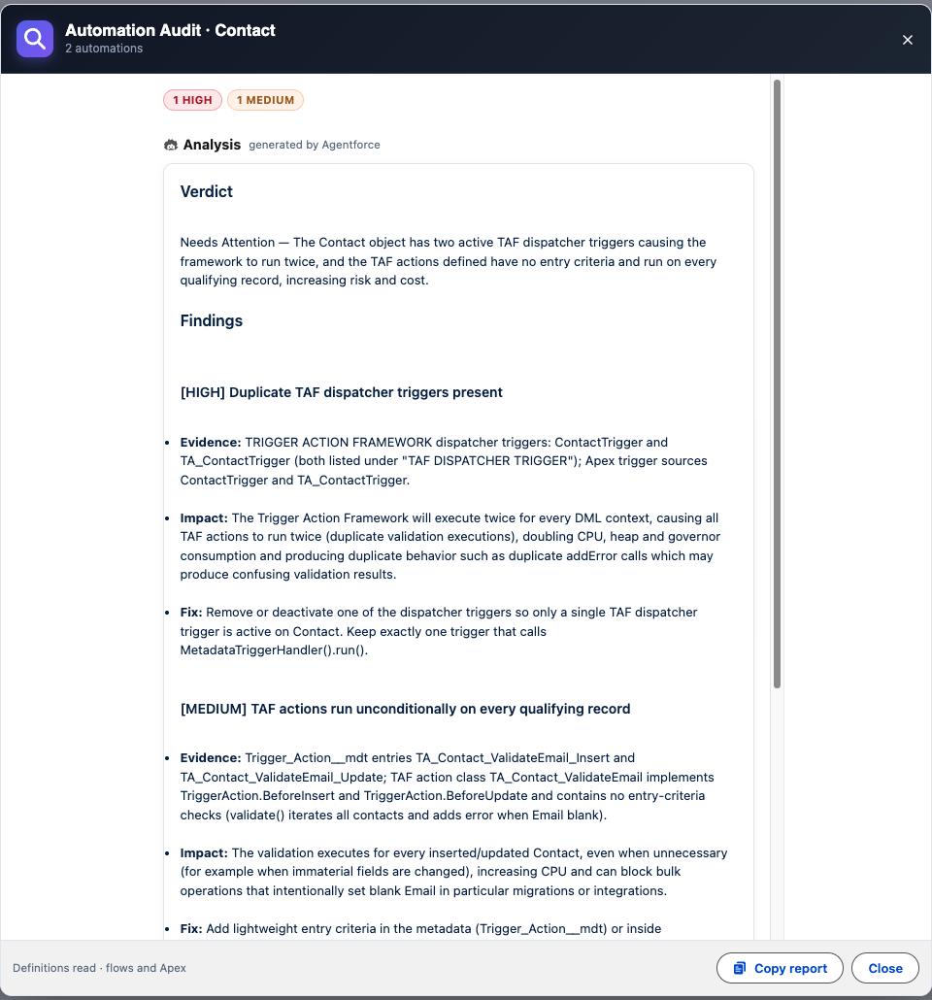
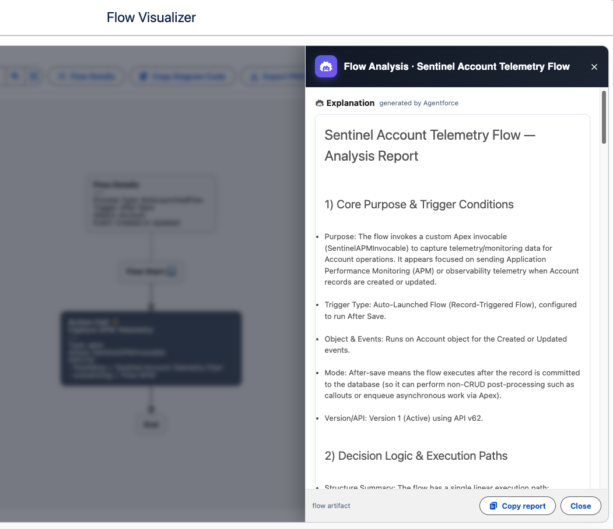

# Trigger Actions Admin Panel

A centralized UI for managing and visualizing Salesforce trigger actions — built on the [Trigger Actions Framework](https://www.mitchspano.com/trigger-actions-framework). The Admin Panel gives administrators and developers a single pane of glass to visualize, organize, and configure automation logic directly in Salesforce, automating the underlying Custom Metadata deployments.

---

## 🚀 Installation

> [!IMPORTANT]
> **Prerequisite:** You must have the core [Trigger Actions Framework](https://github.com/mitchspano/trigger-actions-framework) installed in your org first.

### Option 1: Unlocked Package (Recommended)

- [Install in Production / Developer Org](https://login.salesforce.com/packaging/installPackage.apexp?p0=04tgL000000R5LNQA0)
- [Install in Sandbox](https://test.salesforce.com/packaging/installPackage.apexp?p0=04tgL000000R5LNQA0)

### Option 2: Deploy from Source

---

## ⚙️ Post-Installation Setup

1. Assign the **Trigger Actions Framework Admin** permission set:
   - Go to **Setup → Users → Permission Sets**.
   - Select **Trigger Actions Framework Admin**.
   - Click **Manage Assignments** and assign to your user(s).

2. Add the **Trigger Actions** tab to any Lightning app of your choice:
   - Go to **Setup → App Manager**.
   - Edit your preferred app → **Navigation Items** → add **Trigger Actions**.

---

## ✨ Features

### Org Automation Status Board

A centralized governance board that tracks framework adoption, active TAF dispatcher trigger coverage, unmanaged trigger counts, and active flow distribution across all configured SObjects in your org.

### SObjects Navigation & Overview

Quickly filter and select SObjects from the sidebar, where badge counts summarize adoption at a glance:

- **TAF Actions Count:** Displays the number of framework actions configured on the object.
- **Native Automations Count:** Displays the number of active, non-framework triggers and record-triggered flows on the object.
- **Add SObject:** Register a custom or standard SObject under the framework with a single click.

### Intelligent Discovery & Onboarding

Uncover hidden automation debt in seconds. The Discovery engine scans your entire org for unmanaged Apex Triggers and Record-Triggered Flows, identifying exactly where native logic exists and providing a streamlined path to bring it under the framework's control.

### Unified Hierarchy View & Reordering

Full visibility into every automation on an object. Actions are grouped by execution context — Before Insert, After Update, etc. — and displayed in their precise execution order.

- **Interactive Reordering:** Reorder execution sequences on-the-fly using precise, accessible up/down controls, with a draft banner to save or reset. Saving triggers an automated Custom Metadata deployment in the background.
- **Unified Visibility:** Native triggers and Record-Triggered Flows are tracked alongside framework actions, with direct access to View Source and Flow Visualizer from each item.

### Flow Visualizer & Multi-Level Drill-Down

Visualize Record-Triggered Flows as interactive flowcharts directly in the Admin Panel.

- **Multi-Level Drill-Down:** Click on any Subflow node to fetch its metadata and render its nested flowchart, or click on an Apex Action to trace into its logic diagram and code.
- **Side-by-Side Comparison:** Compare subflows or Apex logic side-by-side with the parent Flow, or expand to a full focused view with breadcrumbs.
- **Rich Diagrams & Exports:** Use the built-in Legend to decode execution nodes, view input/output parameter maps directly inside nodes, and export high-definition PNGs of your flowcharts for offline documentation.

### Agentforce Object Automation Audit & AI Assistant

Unlock deep, AI-powered architectural auditing of your automation footprint directly inside Salesforce using native **Agentforce Models API** integration:

- **Comprehensive Object Audits:** Evaluates all active flows, triggers, and Trigger Action Framework configurations on an SObject. The engine parses live Flow metadata into compact structural diagrams and reads unmanaged Apex triggers and TAF action class bodies, giving the model complete runtime visibility.
- **Risk-Ranked Actionable Findings:** Delivers structured reports with severity tags (`[HIGH]`, `[MEDIUM]`, `[LOW]`), evidence traces, operational impact assessments, and concrete remediation steps (such as eliminating DML in loops, fixing recursive updates, or merging redundant logic).
- **In-Visualizer Flow & Apex Analysis:** Open the AI Assistant directly within the **Flow Visualizer** or **Apex Visualizer** to generate instant architectural explanations of trigger criteria, decision branches, invocable actions, and governor limit risks.
- **Domain-Aware Guardrails:** Eliminates false positives by recognizing TAF dispatcher triggers as framework entry points and respecting managed package constraints.
- **Multi-Tier Audit Caching:** Session- and prompt-versioned memory caching (`auditCache`) eliminates redundant API round trips and prevents token waste when navigating between objects.
- **Graceful Offline Fallback:** In orgs where Agentforce is not enabled, the system seamlessly falls back to a clean deterministic inventory summary.

### Deterministic Field Contention Engine

Identify race conditions before they hit production. The engine statically parses Flow assignment and update nodes across all active Record-Triggered Flows on an object, detecting field-level write collisions and presenting verified findings directly in the audit panel.

### Developer Source View & Apex Visualizer

Inspect implementation logic without leaving the UI.

- **Apex Logic Flowcharts:** Automatically parse Apex source code and generate flowchart diagrams for classes and methods (including auto-detection of `@InvocableMethod` entry points).
- **Direct Source Inspection:** View full Apex class bodies side-by-side with logic diagrams for rapid validation.

### Smart Action Builder

Browse only the Apex classes that implement Trigger Action interfaces. On selection, the tool auto-detects and maps supported trigger interfaces directly to your configuration — no guesswork required.

### Operational Controls

Instantly toggle bypasses for data loads or maintenance windows with immediate visual feedback. The active/disabled state of each action is visible at a glance, enabling real-time control over org-wide automations.

---

## 📖 Framework Documentation

For detailed documentation on the Trigger Actions Framework — writing Action classes, bypass logic, advanced patterns — visit the [official documentation site](https://www.mitchspano.com/trigger-actions-framework) or the [GitHub repository](https://github.com/mitchspano/trigger-actions-framework).

---

## 📝 Important Notes

- **Metadata Deployments**: Saving changes triggers a background metadata deployment. Changes typically take 5-10 seconds to reflect in the UI.
- **Deletion**: For security and stability, the Trigger Actions Admin Panel does not support deleting records. Use Salesforce Setup (Custom Metadata Types) or VS Code to remove configuration records.

---

## 🔐 Security Considerations

The **Flow Visualizer** and **Apex Code Visualizer** read live metadata (Flow definitions, sObject describes, Apex bodies) from the Salesforce **Tooling / REST API**. To keep this responsive and avoid Apex callout governor limits, these calls are made **directly from the browser**, authenticated with the current user's **session ID**.

**How the session token is handled**

- The session ID is obtained from the `SessionIdPage` Visualforce page (`$Api.Session_ID`) via `OrgSessionController.getSessionId()` and sent as a `Bearer` token on the client-side API calls.
- It is the **logged-in user's own session**, so every call runs **as that user** and honors their object/field permissions. Server-side Apex queries additionally run `WITH USER_MODE` / `with sharing`.
- The token is **not cached or persisted** — `getSessionId` is `cacheable=false`, and the value lives only in page memory for the duration of the session.

**What this means for you**

- The session token is present in the browser while the page is open. As with any tool that surfaces a session, **restrict access to trusted administrators** — the Admin Panel is gated behind the **Trigger Actions Framework Admin** permission set, and you should not broaden that assignment.
- Standard org hardening still applies and is recommended: login IP ranges, session timeout, and **"Lock sessions to the IP address from which they originated."**
- Diagram text (flow/apex labels) is rendered with HTML labels disabled and Mermaid's `strict` sanitization, so metadata text cannot be interpreted as markup.

> If your security posture does not permit a session token in the browser, the visualizer callouts would need to be re-routed through server-side Apex (e.g., a Named Credential). The rest of the Admin Panel does not depend on this pattern.

### CORS requirement

Because the visualizer calls the API from the browser, your org must allow the Lightning domain as a CORS origin:

1. Go to **Setup → Security → CORS**.
2. Under **Allowed Origins List**, add your Lightning domain (e.g., `https://<your-domain>.lightning.force.com`).

If diagrams fail to load with a CORS / callout error, this step is usually the cause.

---

## 📋 Changelog

### v5.0.0

- **Added** Agentforce Object Automation Audit — AI-powered architectural audits of object automation footprints powered directly by Salesforce's Models API with deterministic offline fallback
- **Added** Deterministic Field Contention Engine — statically extracts field writes from Flow metadata to detect multi-flow write collisions and potential race conditions
- **Added** Org Automation Status Board — org-wide overview summarizing TAF adoption, dispatcher trigger status, native trigger/flow distribution, and deep audit entry points per SObject
- **Added** Multi-Tier Audit Caching (`auditCache`) — prompt-versioned caching in page memory to eliminate redundant AI calls
- **Added** Automated Model Conformance check script (`modelConformance.apex`) to guard against hallucination and rule drift
- **Optimized** `getAllOrgSObjects()` sorting in `TriggerActionService` using native platform sort, eliminating CPU timeout exceptions in large org schemas
- **Expanded** test suites across Apex and LWC Jest with 100% test pass rate and high code coverage

### v4.1.0

- **Renamed** the project back from "Automation Command Center" to **Trigger Actions Admin Panel** (with the tab renamed to **Trigger Actions**)
- **Overhauled** empty-state dashboard layout under three visual pillars (Discover, Understand, Govern) using high-fidelity inline SVG illustrations and updated copy descriptions
- **Removed** interactive card triggers/buttons from the dashboard cards, standardizing them as informational layouts with a primary "Run Discovery" action in the footer
- **Refactored** stylesheet to implement SLDS design tokens, enabling native dark mode support in the dashboard layout
- **Cleaned up** obsolete and orphaned CSS styling classes from deleted global stats and welcome panels
- **Updated** README documentation to feature the new dashboard and SObjects navigation sidebar annotations

### v4.0.0

- **Added** Flow Details panel — version, status, API version, trigger order, run mode, and description, sourced from the flow's own metadata
- **Added** a diagram Legend, full-diagram PNG export, and an "unsupported element" placeholder so diagrams never silently drop nodes
- **Improved** drill-down — opens in a focused full view by default with a "Compare with parent flow" toggle, and a clean aligned side-by-side compare view
- **Fixed** edge-label rendering (labels are now centered on their connector) and special-character handling in flow labels
- **Replaced** drag-and-drop action reordering with precise, accessible up/down move buttons
- **Fixed** the Native Automations panel briefly showing the previous object's results while switching objects
- **Widened** the visualizer modals to use more of the viewport
- **Hardened** security — the session token is no longer cached, Mermaid runs in strict mode, and the browser session-token model + CORS requirement are documented
- **Added** continuous integration (ESLint + Jest) and expanded unit-test coverage

### v3.0.0

- **Renamed** from "Trigger Actions Admin Panel" to **Automation Command Center**
- **Removed** the dedicated Lightning app — the Command Center is now a standalone tab that can be added to any app
- **Added** Flow Visualizer — interactive flowchart rendering of Record-Triggered Flows
- **Added** Apex Visualizer — AST-powered source code visualization for Apex classes
- **Updated** framework documentation links to the [official doc site](https://www.mitchspano.com/trigger-actions-framework)

### v2.0.0

- Introduced the Command Center dashboard with org-wide automation overview
- Added Discovery engine for scanning unmanaged triggers and flows
- Added native trigger and Record-Triggered Flow tracking alongside framework actions
- Added one-click SObject initialization

### v1.0.0

- Initial release with hierarchy view, action creation, bypass toggles, and source view

---

## ☕ Support

If this project helps you, please consider supporting its development:

---

## 🤝 Contributing

Contributions are welcome! Please feel free to open issues or submit pull requests.
